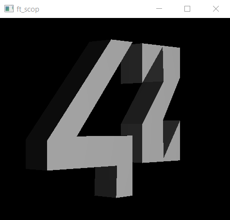
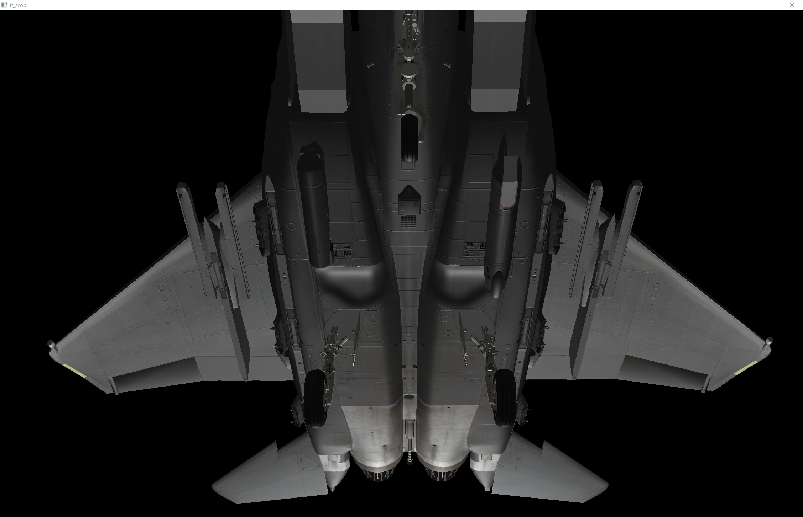

<h1 align="center">scop</h1>

<h3 align="center">Baby's first 3D steps</h3>

	
	

	

`scop` is a small project in the 42 cursus that introduces us to the world of 3D rendering. Essentially, the following is required:
- Parse a .obj file and display it in perspective.
- Be able to apply textures to the object at the press of a key, with a smooth transition.
- **No libraries** to load the object, make the matrices, load shaders, textures...
- External libraries are *only* allowed to handle the window and the events (glfw...).

I overdid it a little. For fun and to explore 3D rendering, I added the following features as bonuses:
- Blinn-Phong lighting model: ambient, diffuse and specular lighting.
- Wavefront material support: load material properties and textures from file.
- Rendering an object that has multiple materials.
- Face-normals and vertex-normals visualization.
- Normal maps support: `bump`/`map_bump` directive in .mtl file.
- Wireframe mode.
- Light source in world that can be moved freely.
- FPS-style camera controls that are roll-stabilized, for natural movement.
- Cross-platform support (didn't have to do much, thanks Odin!).

This was my first time using a 3D API like OpenGL. I also used this project to try out Odin, since it looked like an interesting language and a good fit. tl;dr: Odin is great, and I'll use it again!

### Controls
- `WASD`: Move camera horizontally
- `←↑↓→`: Pan camera
- `Space`/`Shift`: Move camera up/down
- `Z`/`X`: Increase/decrease FOV
- `R`: Toggle rotation
- `T`: Toggle textures
- `F`: Move light to current position
- `Tab`: Toggle wireframe
- `N`: Show vertex normal vectors, if they are present
- `<`/`>`: Adjust size of vertex normal vectors
- `1`/`2`/`3`/`4`: Change active shader:
	1. Default shader
	2. Face-normals shader
	3. Vertex-normals shader
	4. For testing purposes (transparency shader)

### How to build
You need [Odin](https://odin-lang.org/) installed. Then, just run the build script for your platform (`build.sh`/`build.bat`).

This project was last built for and with Odin release `dev-2025-02`.

### Showcase:

A free F-15E model I found online, with normal maps applied.
